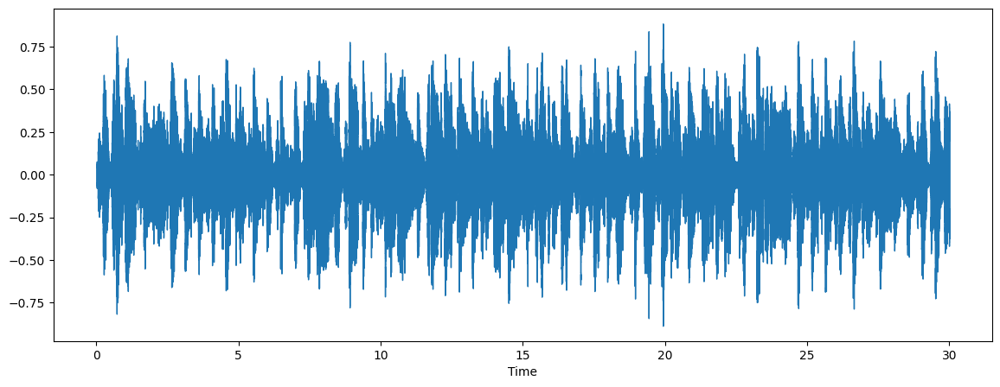
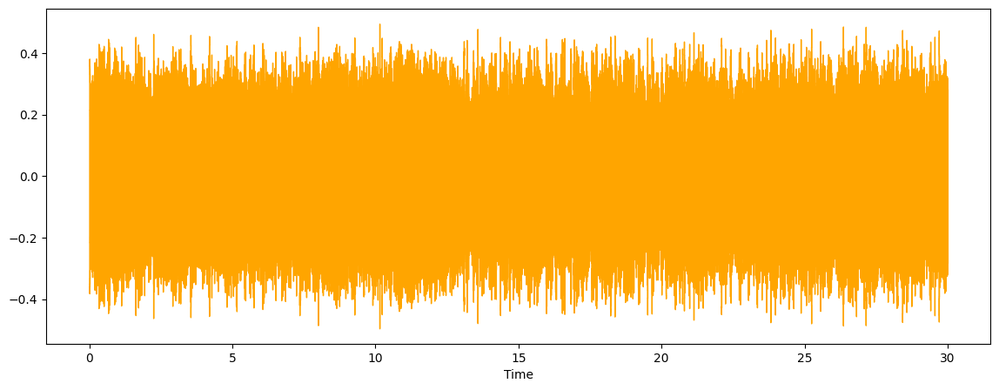
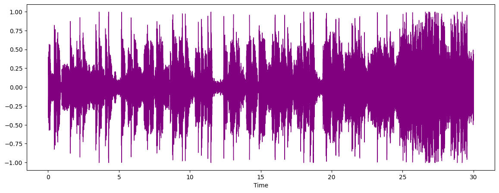
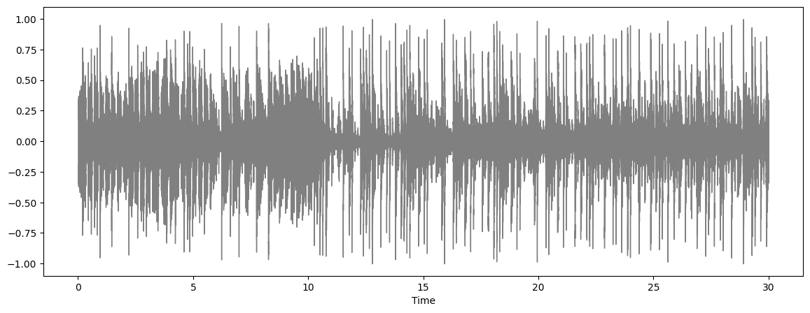

# Music Genre Classification Project 🎶

This project involves classifying music genres using machine learning models. The dataset contains various music features extracted from audio files, and the goal is to predict the genre of a song based on these features.


## Overview 📊
In this project, we:

1. **Preprocess the data**: Clean the data, extract relevant features, and scale the data.
2. **Visualize the audio**: Display waveform plots of sample audio files.
3. **Build classification models**: Train models like Random Forest and XGBoost.
4. **Evaluate the models**: Assess model performance through accuracy and error rates.

## Requirements ⚙️

- Python 3.x
- Libraries: `numpy`, `pandas`, `matplotlib`, `seaborn`, `librosa`, `IPython`, `sklearn`, `xgboost`

To install the required libraries, use:
```bash
pip install numpy pandas matplotlib seaborn librosa scikit-learn xgboost
```

## Usage 💻

1. **Data Loading**:
   Load the dataset containing audio features and genre labels.
   ```python
   music_data = pd.read_csv('/path/to/file.csv')
   ```

2. **Audio Visualization**:
   Load and display the waveform of a sample audio file.
   ```python
   path = '/path/to/audio/file.wav'
   x, sr = librosa.load(path)
   librosa.display.waveshow(x, sr=sr)
   ```

3. **Preprocessing**:
   - Normalize features using `MinMaxScaler`.
   - Encode genre labels using `LabelEncoder`.

4. **Model Training**:
   Use machine learning models like Random Forest and XGBoost to train on the data.
   ```python
   rf = RandomForestClassifier(n_estimators=1000, max_depth=10, random_state=0)
   xgb = XGBClassifier(n_estimators=1000, learning_rate=0.05)
   ```

5. **Model Evaluation**:
   Plot accuracy and error rates for both training and testing sets.
   ```python
   # Accuracy and error visualization
   axs[0].plot([...], train_accuracies, label="train", marker='o', color='blue')
   axs[1].plot([...], train_errors, label="train", marker='o', color='blue')
   ```

## Results 📈

- The models (Random Forest & XGBoost) are evaluated based on their **accuracy** and **error** on both the training and testing sets.
- Plots for **accuracy** and **error** will help you visualize how the models perform.

## Blues


## Metal


## Pop


## HipHop


## Conclusion 🎉

This project aims to explore the power of machine learning for music genre classification. With proper feature engineering and model selection, you can achieve accurate predictions for various music genres.

Happy coding and enjoy the music! 🎶